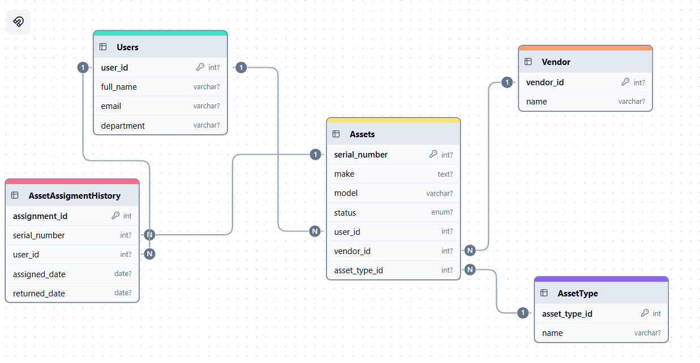
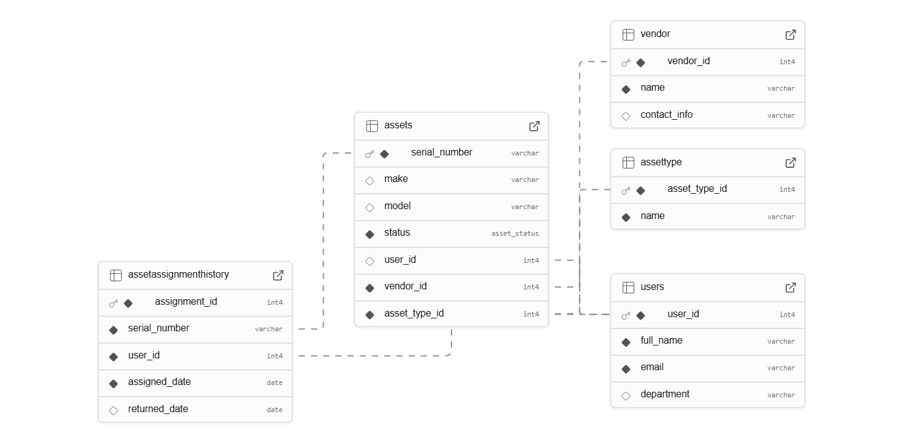

# 📊 Modelo Entidad–Relación – Sistema de Inventario de Activos

Este modelo representa el diseño lógico de una base de datos para una aplicación que gestiona activos de TI (principalmente laptops y monitores) dentro de una empresa. La base de datos permite registrar, asignar y rastrear el estado de los activos, así como mantener un historial de asignaciones.

---

## 🧩 Entidades y Atributos

### 1. **Users**
- `user_id` (PK): Identificador único del usuario
- `full_name`: Nombre completo
- `email`: Correo electrónico
- `department`: Departamento

### 2. **Assets**
- `serial_number` (PK): Número de serie único del activo
- `make`: Marca del activo (ej. Dell, HP)
- `model`: Modelo del activo
- `status` (ENUM): Estado actual del activo (`'free'` o `'assigned'`)
- `user_id` (FK): Referencia al usuario asignado (nullable)
- `vendor_id` (FK): Referencia al proveedor (Company Owned, KC Rentas, New Era)
- `asset_type_id` (FK): Tipo de activo (Laptop, Monitor)

### 3. **Vendor**
- `vendor_id` (PK): Identificador único del proveedor
- `name`: Nombre del proveedor (Company Owned, KC Rentas, New Era)

### 4. **AssetType**
- `asset_type_id` (PK): Identificador del tipo de activo
- `name`: Nombre del tipo (Laptop, Monitor)

### 5. **AssetAssignmentHistory**
- `assignment_id` (PK): Identificador único del historial de asignación
- `serial_number` (FK): Número de serie del activo asignado
- `user_id` (FK): Usuario al que se asignó el activo
- `assigned_date`: Fecha de asignación
- `returned_date`: Fecha de devolución (nullable)

---

## 🔗 Relaciones

| Entidad A                  | Relación              | Entidad B                    | Cardinalidad     |
|----------------------------|------------------------|-------------------------------|------------------|
| Users ↔ Assets             | Uno a Muchos           | Un usuario puede tener varios activos              | 1 a N            |
| Assets ↔ Vendor            | Muchos a Uno           | Cada activo proviene de un proveedor               | N a 1            |
| Assets ↔ AssetType         | Muchos a Uno           | Cada activo tiene un tipo definido                 | N a 1            |
| Assets ↔ AssetAssignmentHistory | Uno a Muchos   | Un activo puede tener múltiples asignaciones históricas | 1 a N       |
| Users ↔ AssetAssignmentHistory | Uno a Muchos   | Un usuario puede aparecer en varias asignaciones   | 1 a N            |

---

## 🖼️ Diagrama Entidad–Relación

 

> *Nota: Este diagrama representa las relaciones descritas anteriormente. Incluye claves primarias, claves foráneas y cardinalidades correspondientes.*

---

## 📋 Reglas de Negocio

A continuación se presentan las reglas de negocio que definen el comportamiento esperado de los datos dentro del sistema de inventario:

1. **Asignación única de activos**  
   - Cada activo (laptop o monitor) puede estar asignado únicamente a un usuario a la vez.

2. **Estados de activos**    
   - El estado del activo es un valor controlado mediante ENUM: `'free'` (disponible) o `'assigned'` (asignado a un usuario).
   - Si un activo tiene estado `'free'`, no debe estar vinculado a ningún usuario (`user_id` debe ser `NULL`).

3. **Proveedores válidos**  
   - Todos los activos deben pertenecer a uno de los siguientes proveedores:
     - **Company Owned**
     - **KC Rentas**
     - **New Era**
   - No se permite registrar activos con proveedores fuera de esta lista.

4. **Unicidad del número de serie**  
   - El campo `serial_number` debe ser único para cada activo. No puede haber dos activos con el mismo número de serie.

5. **Historial de asignaciones**  
   - Cada vez que un activo se asigna o devuelve, debe registrarse un nuevo evento en la tabla `AssetAssignmentHistory` con las fechas correspondientes (`assigned_date` y `returned_date`).

6. **Tipos de activos predefinidos**  
   - Todos los activos deben clasificarse como uno de los tipos definidos en la tabla `AssetType`, como por ejemplo:
     - **Laptop**
     - **Monitor**
   - No se permiten tipos personalizados fuera del catálogo existente.

7. **Integridad referencial obligatoria**  
   - No se puede asignar un activo a un usuario que no exista en el sistema.
   - No se puede registrar un activo sin un proveedor válido ni un tipo de activo válido.

---

## 🖼️ Modelado de Datos (Supabase)

  

> *La imagen muestra el diagrama de entidad–relación generado automáticamente en Supabase, reflejando las relaciones entre las tablas y las claves primarias/foráneas.*

